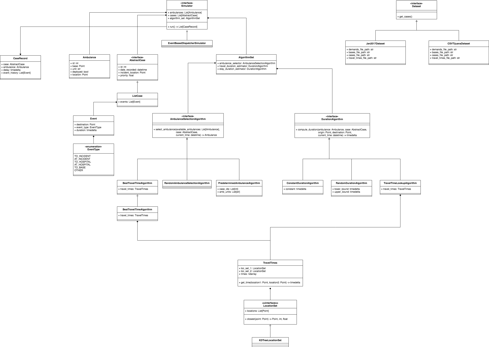

# Ambulance Dispatch Simulation

A library to do ambulance dispatch simulation and analysis.

Try: `python3 main.py --settings tim --ambulances 7 --bases 7`

python3 main.py --help

## Dependencies

- pandas
- scipy
- numpy
- geopy
- termcolor
- matplotlib

In Ubuntu, Python 3.6 seems to be missing "tkinter". To install,

`sudo apt-get install python3.6-tk`

## Project UML

## TODO

- Best coverage algorithm

- Best coverage/Fastest ambulance tension algorithm
  
- Introduce visualization component

- Introduce testing framework

## Components

# Cases
# Location Sets (e.g. Bases, Demands)
# Ambulances
# Events
# Simulators
# Generators
# Ambulance Selection Algorithms
# Metrics
