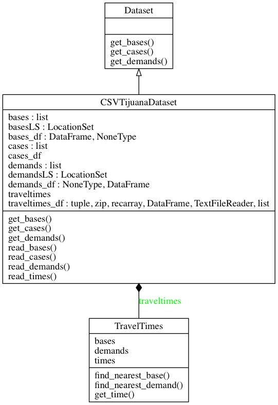
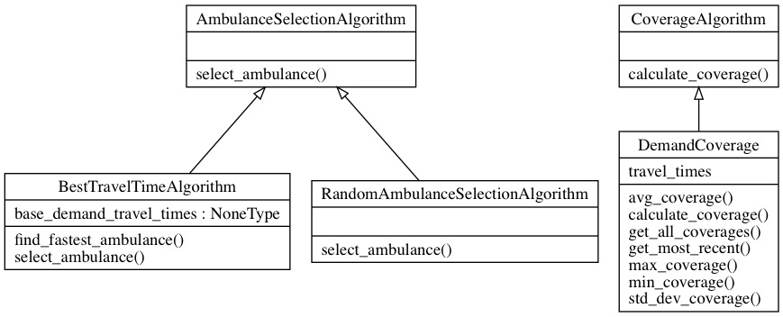
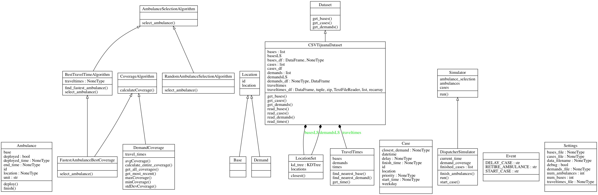
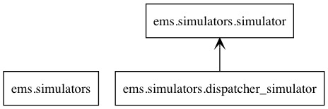
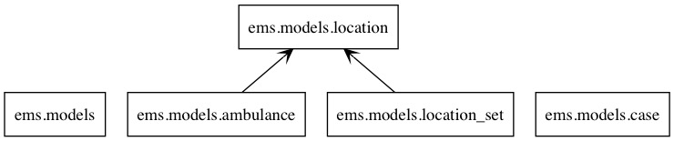
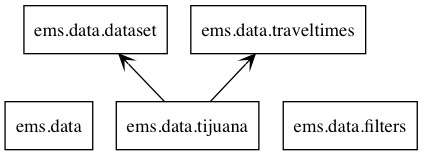
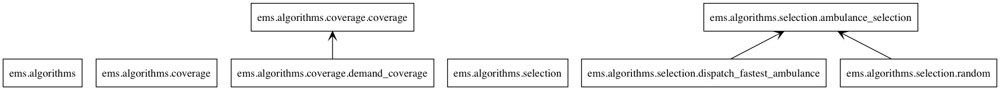
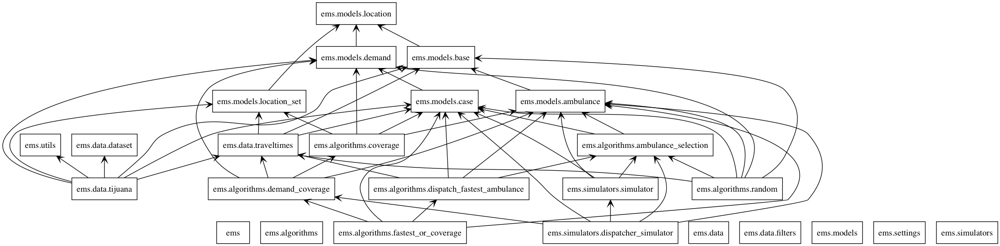

# Ambulance Dispatch Simulation

A library to do ambulance dispatch simulation and analysis.

Try: `time python3 main.py --ambulances 7 --bases 7`

To run the simulation, take a look at `main.py`. Notice the filepaths there. You will need to edit
`file_path`, `demands_filepath`, and `bases_filepath` to point at the Cruz Roja datasets.

To test, take a look at `test.py`. Similar to main.py, you will need to edit
`file_path`, `demands_filepath`, and `bases_filepath` to point at the Cruz Roja datasets.

You'll notice that an exception will be thrown. This is because the datasets will require
labels in the CSV files. Add a newline above the datasets, naming the latitudes and longitudes.

To see this, you may need to uncomment `printData()`. The test program will end up asking you
to proceed when ready. (Press Enter.)

# Class diagrams

Here are the UMLs for each group of programs we have.

## Simulator

## Models

## Data

## Algorithms

## Overall

# Package Diagrams

## Simulator

## Models

## Data

## Algorithms

## Overall

## How To Install auto UML Generator

pyreverse comes with pylint, you need Graphviz: `brew install Graphiz` or `apt install Graphviz`

Then run at the base folder of the repository, do

`pyreverse -o png -p ems ems`

To run all diagrams in parallel, run 

`python3 uml.py`

## TODO

- Make coverage more efficient. (Done. Lesson learned, deepcopying drastically slows down runtime)

- Begin brainstorming and implementing additional simulation evaluation metrics (e.g. coverage, etc.)

- Expand the current testing framework to test the new project infrastructure

- Read settings from file

## High-Level Overview

### Models (ems/models/*)

- Self Explanatory: Ambulance, Base, Case, Demand

- Traveltime object (ems/data/traveltimes.py) stores a numpy array that represents the travel time from each
 base to each demand

### Dataset (ems/data/dataset.py)

- Represents the interface for storing data in working memory

- Expects a list of bases, cases, and demands (__subject to change__) at the most basic level

### TijuanaDataset (ems/data/tijuana.py)

- Implementation of Dataset

- Reads bases, cases, and demands from file

- Reads traveltimes from file (note that this is not a requirement for the dataset interface, because
traveltimes is only needed for the algorithm)

### Filters (ems/data/filters.py)

- May not be necessary; just a file to store any potential filtering of information from the dataset
for input into the simulator (e.g. base selection)

### Algorithm (ems/algorithms/algorithms.py)

- Represents the interface for the algorithm used by the simulation

- Expects an implementation of ambulance selection given a case and a list of ambulances

### DispatcherAlgorithm (ems/algorithms/dispatcher_algorithm.py)

- Implementation of Algorithm

- Accepts a list of bases, demands, and traveltimes

- Implements ambulance selection with a "fastest ambulance" algorithm by:

  - Finding the closest demand point to the given case by:

    - Building a KD-Tree from the demand points for easy KNN (k=1) computation with the case location

  - Finding a free ambulance whose travel time from its base to that demand point is minimal by:

    - Querying the travel time object for travel times between each free ambulance's base to the demand point

- TBD (just need to merge): Support for coverage computation

### Simulator (ems/simulators/simulator.py)

- Represents the interface for the simulator

- Expects a list of ambulances, a list of cases, and an implementation of a "run" function

### DispatcherSimulator (ems/simulators/dispatcher_simulator.py)

- Implementation of Simulator

- Run loop explanation:

  - __Stage 1__. Performs the current iteration's "event" and logs the results

    - Events defined at the bottom of the file

  - __Stage 2__. Computes the next iteration's event

  - Keeps track of a "current time" and the current event

  - Keeps track of all "pending cases" (cases that have begun but have not been assigned an ambulance)

  - Keeps track of all ambulances that are attending cases

  - _This is very much like a finite state machine with three states: "Start case", "Retire ambulance",
  and "Delay case"_

- Note that demands, traveltimes, and bases are __not__ initialized here because they are not essential
to the simulation; instead they are just used by the algorithm for ambulance selection

### Utils (ems/utils)

  - Stuff I have no clue where to put (mostly pandas file parsing)

### Settings (ems/settings)

  - Object to contain all configuration related information (e.g. filepaths, simulation parameters, etc.)
